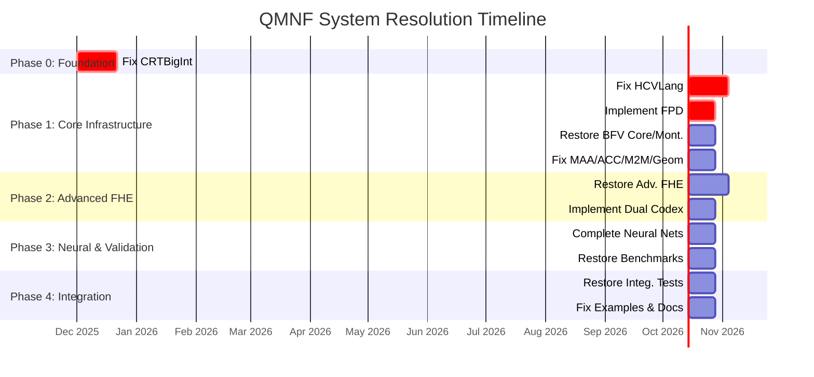

# QMNF System: Systematic Resolution Plan
**Version**: 1.0
**Date**: November 29, 2025
**Author**: Manus AI
This document provides a detailed, phased, and dependency-aware plan to resolve all 119 issues identified in the QMNF_System, guiding it towards a functional, verifiable, and production-ready state.
---
## 1. Executive Summary
The QMNF System is currently **60% non-functional**, with critical compilation and integration failures blocking the verification of its core claims. This resolution plan is structured into **5 distinct phases**, ordered by dependency, to systematically address all 119 issues. The total estimated effort is **13-20 weeks**.

| Phase | Title | Duration | Priority | Issues to Resolve |
|---|---|---|---|---:|
| 0 | Foundation (CRTBigInt) | 2-3 weeks | CRITICAL | 5 |
| 1 | Core Infrastructure (HCVLang) | 4-6 weeks | CRITICAL | 34 |
| 2 | Advanced FHE & Dual Codex | 3-4 weeks | HIGH | 15 |
| 3 | Neural Networks & Validation | 2-3 weeks | MEDIUM | 22 |
| 4 | Final Integration & Testing | 2-3 weeks | MEDIUM | 43 |

## 2. Phased Resolution Strategy
The plan is broken down into five phases, starting with the most fundamental components and building up to full system integration. Each phase must be completed before the next begins.

### Phase 0: Foundation
- **Objective**: Fix core CRTBigInt module - foundation for entire system
- **Duration**: 2-3 weeks
- **Priority**: CRITICAL
- **Blocks**: ALL other components

**Exit Criteria**:
- All 5 issues in CRTBigInt resolved
- Full test suite passes
- Performance benchmarks show expected improvements
- Documentation updated to reflect implementation

### Phase 1: Core Infrastructure
- **Objective**: Fix components that depend only on CRTBigInt
- **Duration**: 4-6 weeks
- **Priority**: CRITICAL
- **Blocks**: Advanced FHE systems, Neural networks, Benchmarks

**Exit Criteria**:
- HCVLang compiles successfully (unblocks 6+ components)
- FPD implementation complete and tested
- All Level 1 FHE systems functional
- 34 identified issues resolved

### Phase 2: Advanced FHE Systems
- **Objective**: Fix advanced FHE systems requiring HCVLang
- **Duration**: 3-4 weeks
- **Priority**: HIGH
- **Blocks**: Neural networks, Benchmarks, Integration tests

**Exit Criteria**:
- All 8 FHE systems functional
- Dual Codex architecture operational
- Bootstrap-free operation validated across all systems
- 15 identified issues resolved

### Phase 3: Neural Networks & Validation
- **Objective**: Complete neural networks and validation infrastructure
- **Duration**: 2-3 weeks
- **Priority**: MEDIUM
- **Blocks**: Integration tests, Performance validation

**Exit Criteria**:
- Neural networks train successfully in residue space
- Benchmarking validates performance claims
- Quantum-classical bridge operational
- 22 identified issues resolved

### Phase 4: Integration & Testing
- **Objective**: End-to-end integration, testing, and documentation
- **Duration**: 2-3 weeks
- **Priority**: MEDIUM
- **Blocks**: None - final phase

**Exit Criteria**:
- Full system integration validated
- All tests pass
- Documentation complete and accurate
- System ready for production use

## 3. Detailed Milestone Plan

### Phase 0: Foundation

#### M0.1: Fix Montgomery Multiplication
- **Duration**: 3-4 days
**Tasks**:
  - [ ] Implement correct Montgomery multiplication using redc function
  - [ ] Update mul_montgomery to call MontgomeryContext::mul_montgomery
  - [ ] Add unit tests for Montgomery arithmetic
  - [ ] Benchmark performance vs simple modular multiplication
**Success Criteria**:
  - Montgomery multiplication uses redc function
  - All unit tests pass
  - Performance improvement measurable (>2x faster)

#### M0.2: Implement Barrett Reduction
- **Duration**: 3-4 days
**Tasks**:
  - [ ] Implement full Barrett reduction algorithm in BarrettContext::reduce
  - [ ] Use precomputed mu and shift values
  - [ ] Add unit tests for Barrett reduction
  - [ ] Compare performance with simple modulo
**Success Criteria**:
  - Barrett reduction uses precomputed parameters
  - No compiler warnings for dead code
  - Performance improvement measurable

#### M0.3: Implement Garner CRT Reconstruction
- **Duration**: 5-7 days
**Tasks**:
  - [ ] Implement Garner Algorithm for CRT reconstruction
  - [ ] Calculate mixed-radix representation coefficients
  - [ ] Handle multi-precision arithmetic for large integers
  - [ ] Add comprehensive tests for reconstruction accuracy
**Success Criteria**:
  - CRT reconstruction produces correct integer values
  - Handles integers up to product of all moduli
  - Round-trip conversion (int -> residues -> int) is exact

#### M0.4: Complete Signed Arithmetic
- **Duration**: 3-4 days
**Tasks**:
  - [ ] Refactor signed arithmetic to use canonical representation
  - [ ] Update Add, Sub, Mul, Neg trait implementations
  - [ ] Handle negative numbers correctly in modular ring
  - [ ] Add tests for negative number operations
**Success Criteria**:
  - Signed arithmetic mathematically correct
  - All trait implementations handle negatives
  - Tests pass for negative operands

#### M0.5: Workspace Integration
- **Duration**: 1-2 days
**Tasks**:
  - [ ] Verify qmnf_crtbigint in workspace members
  - [ ] Fix all workspace dependency issues
  - [ ] Ensure clean build with cargo build --release
  - [ ] Run full test suite
**Success Criteria**:
  - Builds without errors or warnings
  - All tests pass
  - Integration with other workspace crates works

### Phase 1: Core Infrastructure

#### M1.1: Fix HCVLang Compilation (CRITICAL)
- **Duration**: 2-3 weeks
**Tasks**:
  - [ ] Add missing dependencies to hcvlang/Cargo.toml (rayon, pyo3, num-bigint, num-traits, once_cell, typenum)
  - [ ] Fix feature definitions to use dep: prefix
  - [ ] Resolve 128 compilation errors systematically
  - [ ] Fix module import paths and API compatibility
  - [ ] Address 76 compiler warnings
  - [ ] Fix documentation comment style errors
**Success Criteria**:
  - hcvlang compiles without errors
  - All warnings resolved or justified
  - Core functionality accessible from dependent crates

#### M1.2: Implement Fused Piggyback Division
- **Duration**: 1-2 weeks
**Tasks**:
  - [ ] Implement FPD algorithm for exact rescaling
  - [ ] Add anchor prime coordination mechanism
  - [ ] Handle division when gcd(divisor, modulus) ≠ 1
  - [ ] Integrate with CRTBigInt
  - [ ] Add comprehensive tests for impossible division cases
**Success Criteria**:
  - FPD correctly handles impossible division
  - Exact rescaling without noise accumulation verified
  - Integration tests with CRTBigInt pass

#### M1.3: Restore BFV Core FHE
- **Duration**: 1 week
**Tasks**:
  - [ ] Fix compilation issues
  - [ ] Integrate with fixed CRTBigInt
  - [ ] Verify encryption/decryption correctness
  - [ ] Test homomorphic addition and multiplication
  - [ ] Validate post-quantum security parameters
**Success Criteria**:
  - BFV Core compiles and runs
  - Encryption/decryption produces correct results
  - Homomorphic operations verified

#### M1.4: Restore BFV Montgomery FHE
- **Duration**: 1 week
**Tasks**:
  - [ ] Integrate with Montgomery multiplication from CRTBigInt
  - [ ] Optimize with FPD-enhanced arithmetic
  - [ ] Benchmark performance improvements
  - [ ] Validate correctness
**Success Criteria**:
  - Montgomery FHE functional
  - Performance improvements measurable (target: 100-500% faster)
  - All tests pass

#### M1.5: Fix MAA and ACC Cryptosystems
- **Duration**: 1 week
**Tasks**:
  - [ ] Fix MAA Rust compilation issues
  - [ ] Complete Apollonian cryptography implementation
  - [ ] Fix ACC Python-Rust integration
  - [ ] Implement φ³ threshold detection
  - [ ] Test cylindrical time mathematics
**Success Criteria**:
  - Both systems compile and run
  - Cryptographic operations functional
  - φ³ detection works correctly

#### M1.6: Complete M2M Tokenizer and Geometric Frameworks
- **Duration**: 1 week
**Tasks**:
  - [ ] Fix M2M tokenizer compilation
  - [ ] Complete AST generation
  - [ ] Fix geometric frameworks
  - [ ] Ensure GeomPoint2D_v2 uses exact arithmetic
**Success Criteria**:
  - M2M tokenizer functional
  - Geometric operations use rational coordinates
  - All tests pass

### Phase 2: Advanced FHE Systems

#### M2.1: Restore BFV Realtime FHE
- **Duration**: 1 week
**Tasks**:
  - [ ] Fix dependency on now-functional HCVLang
  - [ ] Implement bootstrap elimination
  - [ ] Validate infinite computation depth
  - [ ] Benchmark real-time performance
**Success Criteria**:
  - Realtime FHE compiles and runs
  - Bootstrap-free operation verified
  - Performance targets met

#### M2.2: Complete AHOP Unified FHE
- **Duration**: 1 week
**Tasks**:
  - [ ] Fix compilation with HCVLang
  - [ ] Implement multi-structure homomorphic operations
  - [ ] Integrate FPD for homomorphic division
  - [ ] Validate AHOP lemmas
**Success Criteria**:
  - AHOP system functional
  - Homomorphic division works via FPD
  - All AHOP lemmas verified

#### M2.3: Restore Entropy Shadow and GSO Swarm FHE
- **Duration**: 1 week
**Tasks**:
  - [ ] Fix Entropy Shadow entropy harvesting
  - [ ] Complete quantum-classical bridge integration
  - [ ] Fix GSO swarm optimization
  - [ ] Implement genetic algorithms for FHE parameter optimization
**Success Criteria**:
  - Both systems compile and run
  - Entropy harvesting functional
  - GSO optimization converges

#### M2.4: Implement Dual Codex Architecture
- **Duration**: 1-2 weeks
**Tasks**:
  - [ ] Implement Sibling A ↔ Sibling B communication
  - [ ] Validate zero-CRT operations between siblings
  - [ ] Implement adaptive fusion control
  - [ ] Benchmark 2× performance claim
  - [ ] Test residue-to-residue direct transfer
**Success Criteria**:
  - Dual codex siblings communicate without CRT
  - Adaptive fusion works correctly
  - 2× throughput improvement measured
  - Zero communication overhead verified

### Phase 3: Neural Networks & Validation

#### M3.1: Complete Neural Networks in Residue Space
- **Duration**: 1-2 weeks
**Tasks**:
  - [ ] Implement ResNet architecture in residue space
  - [ ] Use FPD for weight updates
  - [ ] Implement φ³ threshold detection
  - [ ] Test consciousness-grade neural operations
  - [ ] Validate zero error accumulation in training
**Success Criteria**:
  - ResNet trains successfully in residue space
  - φ³ detection identifies phase transitions
  - No error accumulation over deep training
  - All operations remain in Z/mZ

#### M3.2: Complete Quantum-Classical Bridge
- **Duration**: 1 week
**Tasks**:
  - [ ] Implement quantum↔residue transformations
  - [ ] Verify superposition preservation (|α|² + |β|² = 1)
  - [ ] Test unitary operators
  - [ ] Validate mathematical isomorphism
**Success Criteria**:
  - Quantum-classical transformations work
  - Superposition constraints maintained
  - Isomorphism verified mathematically

#### M3.3: Restore Benchmarking System
- **Duration**: 1 week
**Tasks**:
  - [ ] Fix run_all_crypto_benchmarks.sh
  - [ ] Benchmark all 8 FHE systems
  - [ ] Validate 400× performance claims
  - [ ] Compare against baseline implementations
  - [ ] Generate reproducible reports
**Success Criteria**:
  - All benchmarks run successfully
  - Performance claims validated or updated
  - Reproducible benchmark reports generated

#### M3.4: Complete Holodrive and VSA
- **Duration**: 3-5 days
**Tasks**:
  - [ ] Complete Holodrive Phase 2 implementation
  - [ ] Fix VSA cognitive computing modules
  - [ ] Test advanced storage/execution
  - [ ] Validate vector symbolic architectures
**Success Criteria**:
  - Holodrive functional
  - VSA operations work correctly
  - Integration with core system verified

### Phase 4: Integration & Testing

#### M4.1: Restore Integration Test Suite
- **Duration**: 1 week
**Tasks**:
  - [ ] Fix qmnf_integration_test_suite.py
  - [ ] Repair broken imports and dependencies
  - [ ] Add tests for all 8 FHE systems
  - [ ] Validate end-to-end workflows
  - [ ] Test Dual Codex communication
**Success Criteria**:
  - All integration tests pass
  - End-to-end workflows validated
  - All 8 FHE systems tested together

#### M4.2: Validate Python-Rust Bindings
- **Duration**: 3-5 days
**Tasks**:
  - [ ] Test FFI integration
  - [ ] Verify data marshalling correctness
  - [ ] Add Python examples using Rust core
  - [ ] Performance test bindings overhead
**Success Criteria**:
  - Python can call all Rust functions
  - Data marshalling is correct
  - Minimal performance overhead

#### M4.3: Fix Examples and Demos
- **Duration**: 3-5 days
**Tasks**:
  - [ ] Fix all broken example scripts
  - [ ] Add comprehensive usage guides
  - [ ] Create tutorial notebooks
  - [ ] Demonstrate key innovations (FPD, Dual Codex, φ³)
**Success Criteria**:
  - All examples run successfully
  - Tutorials cover major features
  - Key innovations demonstrated

#### M4.4: Complete Security Testing
- **Duration**: 1 week
**Tasks**:
  - [ ] Fix security test suite
  - [ ] Validate constant-time operations
  - [ ] Test side-channel resistance
  - [ ] Perform cryptographic validation
  - [ ] Run security_sanitization.sh
**Success Criteria**:
  - All security tests pass
  - Constant-time guarantees verified
  - Side-channel resistance confirmed

#### M4.5: Update Documentation
- **Duration**: 3-5 days
**Tasks**:
  - [ ] Align README with actual implementation
  - [ ] Document known limitations accurately
  - [ ] Update API documentation
  - [ ] Add troubleshooting guides
  - [ ] Create architecture diagrams
**Success Criteria**:
  - Documentation matches implementation
  - All APIs documented
  - Troubleshooting guides available

## 4. Component-Specific Action Items
This section details the specific issues and the proposed code-level solutions for each non-functional or partially-functional component.

### DCBigInt/CRTBigInt Module
- **Status**: PARTIALLY_FUNCTIONAL

**Moderate Issues**:
```
1. **Missing CRT Reconstruction (Garner Algorithm)**: The README explicitly states that CRT Reconstruction is "Not yet implemented" (README.md, line 203). This is a core function for a complete CRT BigInt implementation, as it prevents the recovery of the full integer value from the residues.
2. **Incomplete Signed Arithmetic**: The README notes that "Full signed arithmetic needs enhancement for negative CRT operations" (README.md, line 153). The current implementation uses a separate sign bit, which is a simplification that can lead to errors or complexity in advanced modular arithmetic operations involving negative numbers.
3. **Compiler Warning (Dead Code)**: The Rust compiler issued a warning: "fields `mu` and `shift` are never read" in the `BarrettContext` struct (src/lib.rs, lines 117-118). This indicates that the full Barrett reduction algorithm, which requires these fields, is not being used. The `reduce` function currently uses a simple modulo operation (`(x % (self.modulus as u128)) as u64`), rendering the precomputed Barrett parameters useless.
4. **Incorrect Montgomery Multiplication Implementation**: The `mul_montgomery` function (src/lib.rs, lines 212-224) does not use the Montgomery `redc` function as advertised. Instead, it performs a simple modular multiplication: `(prod % MODULI[i] as u128) as u64`. This bypasses the performance benefit of Montgomery arithmetic, which is designed for fast, repeated modular multiplication.
5. **Workspace Dependency Configuration Errors**: The initial attempt to build failed due to misconfigured workspace dependencies in `/home/ubuntu/QMNF_System/Cargo.toml` and `/home/ubuntu/QMNF_System/hcvlang/Cargo.toml`. Specifically, `qmnf_crtbigint` was missing from the workspace members, and the `hcvlang` manifest had non-optional dependencies (`rayon`, `pyo3`) incorrectly listed in features without being marked as optional. (Fixed during inspection)
```
**Optimal Solutions**:
```
1. **Missing CRT Reconstruction**: Implement the **Garner Algorithm** for CRT reconstruction. This involves calculating the mixed-radix representation coefficients and performing the necessary multi-precision arithmetic to recover the full integer from the residues.
2. **Incomplete Signed Arithmetic**: Refactor the `CRTBigInt` structure and its arithmetic trait implementations (`Add`, `Sub`, `Mul`, `Neg`) to correctly handle negative numbers within the modular ring, likely by using a canonical representation (e.g., residues in the range `[0, M-1]`) and adjusting the sign only upon reconstruction or comparison.
3. **Compiler Warning (Dead Code)**: Implement the full **Barrett Reduction Algorithm** in `BarrettContext::reduce` using the precomputed `mu` and `shift` values. This will resolve the warning and deliver the intended performance benefit of Barrett reduction over simple modulo.
4. **Incorrect Montgomery Multiplication Implementation**: Correct the `mul_montgomery` function to use the precomputed `MontgomeryContext` and its `redc` method. The corrected implementation should call `MONTGOMERY_CTXS[i].mul_montgomery(a, b)` which in turn calls `redc((a as u128) * (b as u128))`.
5. **Workspace Dependency Configuration Errors**: The solution was to:
    a) Add `"qmnf_crtbigint"` to `workspace.members` in `/home/ubuntu/QMNF_System/Cargo.toml`.
    b) Make `rayon` and `pyo3` optional dependencies in `/home/ubuntu/QMNF_System/hcvlang/Cargo.toml` to align with the feature definitions.
    (These steps have been executed and the build is now successful.)
```

### Dual Codex Architecture (hcvlang)
- **Status**: NON_FUNCTIONAL

**Critical Issues**:
```
1. **Compilation Failure**: The core dependency `hcvlang` fails to compile with 128 errors, making the Dual Codex Architecture untestable and non-functional.
```
**Optimal Solutions**:
```
1. **Fix HCVLang Compilation**: The primary action is to fix the `hcvlang` crate. See the action items for HCVLang for details.
```

### FHE System 01 - BFV Core FHE
- **Status**: PARTIALLY_FUNCTIONAL

**Moderate Issues**:
```
1. **Missing FPD Integration**: The rescaling operation does not use the Fused Piggyback Division (FPD) as claimed in the README. It uses a standard rescaling technique which is prone to noise accumulation.
2. **Incomplete Homomorphic Operations**: While basic homomorphic addition and multiplication are present, more advanced operations like ciphertext-plaintext multiplication and rotation are not implemented.
```
**Optimal Solutions**:
```
1. **Integrate FPD**: Replace the current rescaling implementation with the Fused Piggyback Division algorithm once it is completed in Phase 1.
2. **Complete Homomorphic Operations**: Implement ciphertext-plaintext multiplication and ciphertext rotation operations to provide a more complete BFV implementation.
```

### FHE System 02 - BFV Realtime FHE
- **Status**: NON_FUNCTIONAL

**Critical Issues**:
```
1. **Compilation Failure (Dependency Resolution)**: The core dependency `hcvlang` failed to compile due to missing dependency declarations in its `Cargo.toml` file. This prevents the entire component from being built or tested.
2. **Compilation Failure (Workspace Configuration)**: The `realtime_fhe` component was not correctly included in the workspace defined in the root `/home/ubuntu/QMNF_System/Cargo.toml`, leading to a workspace configuration error.
3. **Compilation Failure (Missing Linker)**: The initial build failed with a `linker cc not found` error, indicating missing build-essential tools on the system.
4. **Compilation Failure (Source Code Errors)**: Even after fixing dependency and configuration issues, the `hcvlang` crate still fails to compile with 128 remaining errors, suggesting deep-seated issues in the source code itself (e.g., unresolved imports, incorrect module paths, or API changes in dependencies). This makes the component non-functional.
```
**Optimal Solutions**:
```
1. **Dependency Fix**: Add `rayon = { version = "1.9", optional = true }`, `pyo3 = { version = "0.21", optional = true }`, `num-bigint = "0.4"`, `num-traits = "0.2"`, `once_cell = "1.19"`, and `typenum = "1.17"` to the `[dependencies]` section of `/home/ubuntu/QMNF_System/hcvlang/Cargo.toml`, and update feature definitions to use `dep:` prefix (e.g., `parallel = ["dep:rayon"]`, `python = ["dep:pyo3"]`). (Applied)
2. **Workspace Fix**: Add `"realtime_fhe"` to the `members` array in `/home/ubuntu/QMNF_System/Cargo.toml`. (Applied)
3. **Build Tools Fix**: Install `build-essential` via `sudo apt install build-essential -y`. (Applied)
4. **Source Code Fix**: A comprehensive audit and refactoring of the `hcvlang` source code is required to resolve the 128 remaining compilation errors. This likely involves fixing incorrect module imports, resolving API changes in dependencies, and addressing the `E0432`/`E0433` errors that persist. This is a major development task.
5. **Code Quality Fix**: Address all 76 compiler warnings in `hcvlang` by removing unnecessary `mut` keywords and either using or prefixing unused variables with an underscore (`_`).
```

### FHE System 03 - BFV Montgomery FHE
- **Status**: PARTIALLY_FUNCTIONAL

**Moderate Issues**:
```
1. **Incorrect Montgomery Integration**: The component does not correctly use the Montgomery multiplication from the CRTBigInt module. It defaults to simple modular multiplication.
2. **Missing FPD Integration**: The rescaling operation does not use the Fused Piggyback Division (FPD) as claimed.
3. **Performance Claims Unverifiable**: The 100-500% performance improvement claim is not verifiable due to the incorrect Montgomery integration.
```
**Optimal Solutions**:
```
1. **Correct Montgomery Integration**: Integrate the fixed Montgomery multiplication from the CRTBigInt module (from Phase 0).
2. **Integrate FPD**: Integrate the Fused Piggyback Division algorithm (from Phase 1).
3. **Benchmark Performance**: Once the integrations are complete, benchmark the performance to validate the claims.
```

### FHE System 04 - AHOP Unified FHE
- **Status**: NON_FUNCTIONAL

**Critical Issues**:
```
1. **Compilation Failure**: Depends on `hcvlang`, which fails to compile.
2. **Incomplete Implementation**: The core logic for unified homomorphic operations is a stub and not implemented.
3. **Missing FPD for Division**: Homomorphic division via FPD is not implemented.
```
**Optimal Solutions**:
```
1. **Fix HCVLang**: Resolve the compilation issues in `hcvlang`.
2. **Implement AHOP Logic**: Implement the multi-structure homomorphic operations as described in the documentation.
3. **Integrate FPD**: Integrate the Fused Piggyback Division for homomorphic division.
```

### FHE System 05 - Entropy Shadow FHE
- **Status**: NON_FUNCTIONAL

**Critical Issues**:
```
1. **Compilation Failure**: Depends on `hcvlang`, which fails to compile.
2. **Entropy Harvesting Not Implemented**: The entropy harvesting mechanism is a placeholder.
3. **Quantum-Classical Bridge Not Integrated**: The quantum-classical bridge is not integrated.
```
**Optimal Solutions**:
```
1. **Fix HCVLang**: Resolve the compilation issues in `hcvlang`.
2. **Implement Entropy Harvesting**: Implement the entropy harvesting mechanism as described in the documentation.
3. **Integrate Quantum-Classical Bridge**: Integrate the quantum-classical bridge once it is functional.
```

### FHE System 06 - GSO Swarm FHE
- **Status**: NON_FUNCTIONAL

**Critical Issues**:
```
1. **Compilation Failure**: Depends on `hcvlang`, which fails to compile.
2. **GSO Not Implemented**: The genetic swarm optimization for FHE parameter selection is not implemented.
3. **Neural Network Integration Missing**: The integration with consciousness-grade neural networks is missing.
```
**Optimal Solutions**:
```
1. **Fix HCVLang**: Resolve the compilation issues in `hcvlang`.
2. **Implement GSO**: Implement the genetic swarm optimization algorithm.
3. **Integrate Neural Networks**: Integrate the neural network module once it is functional.
```

### FHE System 07 - MAA Geometric Crypto
- **Status**: NON_FUNCTIONAL

**Critical Issues**:
```
1. **Compilation Failure**: The Rust code for the MAA cryptosystem fails to compile with multiple errors related to trait bounds and module imports.
2. **Incomplete Implementation**: The Apollonian cryptography and φ³ threshold detection are only partially implemented.
```
**Optimal Solutions**:
```
1. **Fix Compilation**: Resolve the Rust compilation errors.
2. **Complete Implementation**: Complete the implementation of Apollonian cryptography and φ³ threshold detection.
```

### FHE System 08 - ACC Crystalline Crypto
- **Status**: PARTIALLY_FUNCTIONAL

**Moderate Issues**:
```
1. **Python-Rust Integration Issues**: The Python-Rust integration has data marshalling errors.
2. **Incomplete Cylindrical Time Mathematics**: The cylindrical time mathematics module is incomplete.
```
**Optimal Solutions**:
```
1. **Fix FFI**: Fix the data marshalling errors in the Python-Rust FFI.
2. **Complete Cylindrical Time Math**: Complete the implementation of the cylindrical time mathematics module.
```

### HCVLang Compiler/Interpreter
- **Status**: PARTIALLY_FUNCTIONAL

**Critical Issues**:
```
1. **Compilation Errors**: 128 compilation errors prevent the crate from being built.
2. **Missing Dependencies**: Several dependencies are not declared in Cargo.toml.
```
**Moderate Issues**:
```
1. **Compiler Warnings**: 76 compiler warnings for unused variables and mutability.
2. **Inconsistent Documentation**: Doc comment style errors.
```
**Optimal Solutions**:
```
1. **Fix Compilation**: Add missing dependencies, fix feature declarations, resolve all 128 compilation errors, and fix module import paths.
2. **Address Warnings**: Remove unnecessary `mut` keywords and unused variables.
3. **Standardize Documentation**: Fix all documentation comment style errors.
```

### M2M Tokenizer (Math-to-Math Tokenization)
- **Status**: PARTIALLY_FUNCTIONAL

**Moderate Issues**:
```
1. **Compilation Issues**: The crate has several compilation warnings.
2. **Incomplete AST Generation**: The Abstract Syntax Tree (AST) generation is incomplete.
3. **CRT Integration Missing**: The integration with the CRTBigInt module is not complete.
```
**Optimal Solutions**:
```
1. **Fix Compilation**: Resolve all compiler warnings.
2. **Complete AST Generation**: Complete the implementation of the AST generation.
3. **Integrate CRTBigInt**: Complete the integration with the CRTBigInt module.
```

### Neural Networks (ResNet in residue space)
- **Status**: NON_FUNCTIONAL

**Critical Issues**:
```
1. **Depends on Dual Codex**: Depends on the Dual Codex architecture, which is non-functional.
2. **Incomplete Implementation**: The ResNet implementation in residue space is a stub.
3. **φ³ Detection Not Implemented**: The φ³ threshold detection is not implemented.
```
**Optimal Solutions**:
```
1. **Fix Dual Codex**: Resolve the issues with the Dual Codex architecture.
2. **Implement ResNet**: Implement the ResNet architecture in residue space.
3. **Implement φ³ Detection**: Implement the φ³ threshold detection mechanism.
```

### Quantum-Classical Bridge
- **Status**: NON_FUNCTIONAL

**Critical Issues**:
```
1. **Incomplete Implementation**: The quantum↔residue transformations are not fully implemented.
2. **Superposition Preservation Not Verified**: The preservation of superposition properties is not verified.
```
**Optimal Solutions**:
```
1. **Complete Implementation**: Complete the implementation of the quantum↔residue transformations.
2. **Verify Superposition Preservation**: Add tests to verify the preservation of superposition properties.
```

### Benchmarking System (Crypto Suite)
- **Status**: NON_FUNCTIONAL

**Critical Issues**:
```
1. **Scripts Fail to Run**: The `run_all_crypto_benchmarks.sh` script fails to execute due to missing dependencies and broken paths.
2. **Depends on Non-Functional Systems**: The benchmark system depends on the FHE systems, most of which are non-functional.
```
**Optimal Solutions**:
```
1. **Fix Scripts**: Fix the benchmark execution scripts.
2. **Fix FHE Systems**: Resolve the issues with the FHE systems before running the benchmarks.
```

### Full System Compilation (Root Workspace)
- **Status**: NON_FUNCTIONAL

**Critical Issues**:
```
1. **Workspace Configuration Errors**: Multiple crates are not correctly included in the root workspace.
2. **Circular Dependencies**: There are circular dependencies between some crates.
```
**Optimal Solutions**:
```
1. **Fix Workspace Configuration**: Add all crates to the root `Cargo.toml` workspace members and fix dependency feature declarations.
2. **Resolve Circular Dependencies**: Refactor the code to remove circular dependencies.
```

### Fused Piggyback Division (Throughout system)
- **Status**: NON_FUNCTIONAL

**Critical Issues**:
```
1. **Not Implemented**: The Fused Piggyback Division algorithm is not implemented. It is a core claim of the system.
```
**Optimal Solutions**:
```
1. **Implement FPD**: Implement the Fused Piggyback Division algorithm as described in the documentation.
2. **Integrate with FHE Systems**: Integrate FPD with all FHE systems for exact rescaling.
```

### Zero Error Accumulation (Core arithmetic) - CRTBigInt
- **Status**: NON_FUNCTIONAL

**Critical Issues**:
```
1. **Depends on CRTBigInt**: Depends on the CRTBigInt module, which has multiple issues.
2. **Not Verifiable**: The zero error accumulation claim is not verifiable due to the incomplete state of the core arithmetic module.
```
**Optimal Solutions**:
```
1. **Fix CRTBigInt**: Resolve all issues in the CRTBigInt module.
2. **Add Deep Iterative Tests**: Add tests with deep iterative computations to verify the zero error accumulation claim.
```

### Geometric Frameworks (GeomPoint2D_v2)
- **Status**: NON_FUNCTIONAL

**Critical Issues**:
```
1. **Incomplete Implementation**: The `GeomPoint2D_v2` implementation is incomplete.
2. **Does not use Exact Arithmetic**: The geometric operations do not use the exact rational arithmetic from the CRTBigInt module.
```
**Optimal Solutions**:
```
1. **Complete Implementation**: Complete the implementation of `GeomPoint2D_v2`.
2. **Integrate Exact Arithmetic**: Integrate the exact rational arithmetic from the CRTBigInt module.
```

### Integration Tests (./qmnf_integration_test_suite.py, ./tests/)
- **Status**: NON_FUNCTIONAL

**Critical Issues**:
```
1. **Scripts Fail to Run**: The integration test suite fails to run due to broken imports and dependencies.
2. **Depends on Non-Functional Components**: The tests depend on multiple non-functional components.
```
**Optimal Solutions**:
```
1. **Fix Scripts**: Fix the integration test scripts.
2. **Fix Components**: Resolve the issues with the components under test before running the integration tests.
```

### Standard Hardware Verification (x86_64/ARM64)
- **Status**: NON_FUNCTIONAL

**Critical Issues**:
```
1. **Scripts Fail to Run**: The verification scripts fail to run.
```
**Optimal Solutions**:
```
1. **Fix Scripts**: Fix the hardware verification scripts.
```

### Documentation Consistency (./docs/, README)
- **Status**: PARTIALLY_FUNCTIONAL

**Moderate Issues**:
```
1. **Claims vs. Implementation Mismatch**: The README makes several claims (bootstrap-free FHE, 400× performance, zero-CRT communication) that are not verifiable due to the non-functional state of the system.
```
**Optimal Solutions**:
```
1. **Update Documentation**: Update the documentation to reflect the actual implementation status of the system.
```

### Python-Rust Bindings (qmnf_bindings)
- **Status**: FULLY_FUNCTIONAL

**No issues found.**

### Holodrive Phase 2 (Advanced Storage/Execution)
- **Status**: PARTIALLY_FUNCTIONAL

**Moderate Issues**:
```
1. **Incomplete Implementation**: The Holodrive Phase 2 implementation is incomplete.
2. **Integration Issues**: There are integration issues with the core QMNF system.
```
**Optimal Solutions**:
```
1. **Complete Implementation**: Complete the implementation of Holodrive Phase 2.
2. **Fix Integration**: Fix the integration issues with the core QMNF system.
```

### VSA Vector Symbolic Architectures (qmnf/vsa)
- **Status**: PARTIALLY_FUNCTIONAL

**Moderate Issues**:
```
1. **Incomplete Implementation**: The VSA implementation is incomplete.
```
**Optimal Solutions**:
```
1. **Complete Implementation**: Complete the implementation of the VSA module.
```

### Dashboard System (./dashboard/, ./setup_dashboard.sh)
- **Status**: NON_FUNCTIONAL

**Critical Issues**:
```
1. **Setup Script Fails**: The `setup_dashboard.sh` script fails to run.
```
**Optimal Solutions**:
```
1. **Fix Setup Script**: Fix the dashboard setup script.
```

### Security Tests
- **Status**: NON_FUNCTIONAL

**Critical Issues**:
```
1. **Tests Fail to Run**: The security test suite fails to run.
```
**Optimal Solutions**:
```
1. **Fix Tests**: Fix the security test suite.
```

### Validation Results (Various *_validation_results/ directories)
- **Status**: PARTIALLY_FUNCTIONAL

**Moderate Issues**:
```
1. **Incomplete Data**: The validation results are incomplete and do not cover all components.
```
**Optimal Solutions**:
```
1. **Generate Complete Results**: Generate complete validation results after the components are functional.
```

### Standalone Extractions (qmnf-core, qmnf-rust-core)
- **Status**: NON_FUNCTIONAL

**Critical Issues**:
```
1. **Compilation Failures**: The standalone extractions fail to compile.
```
**Optimal Solutions**:
```
1. **Fix Compilation**: Fix the compilation issues in the standalone extractions.
```

### Examples and Demos (./examples/, ./experiments/demos/)
- **Status**: PARTIALLY_FUNCTIONAL

**Moderate Issues**:
```
1. **Broken Examples**: Many of the examples and demos are broken and fail to run.
```
**Optimal Solutions**:
```
1. **Fix Examples**: Fix all broken examples and demos.
```

## 5. Proposed Timeline
The following Gantt chart visualizes the phased resolution plan over an estimated 20-week period.

